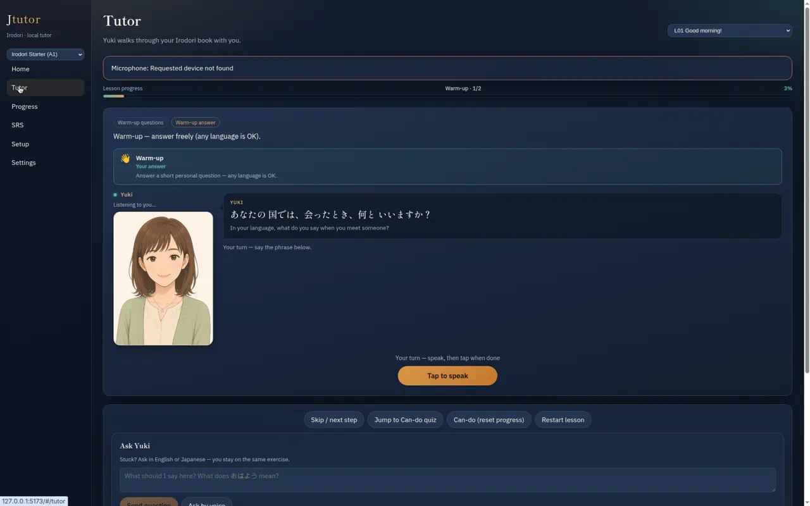
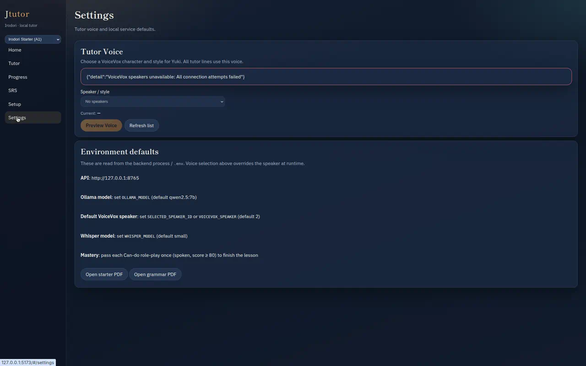
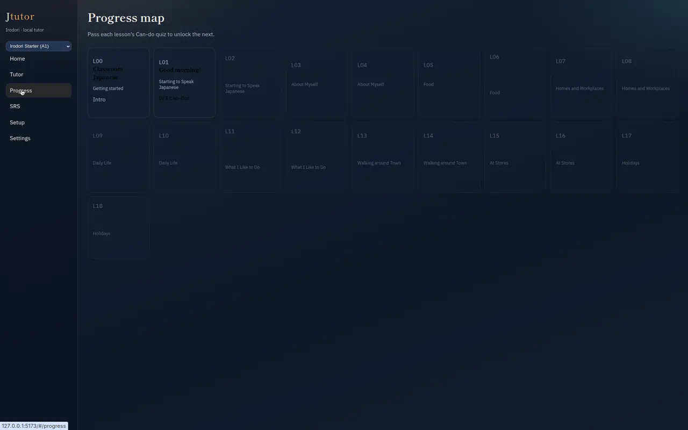
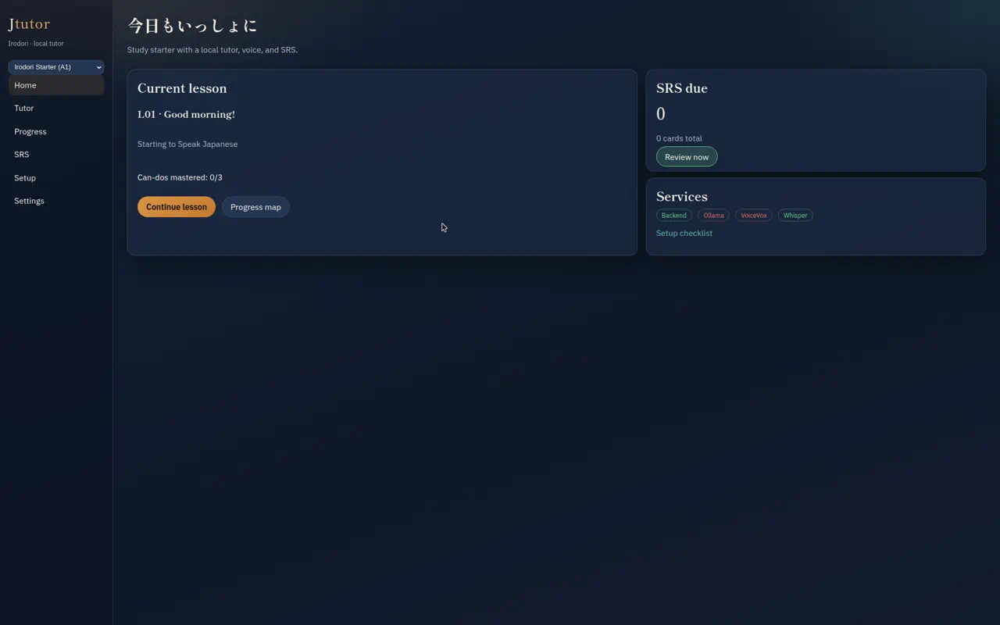

# 01 — UI/UX audit

Current state of the Jtutor desktop UI, measured against the goal of a clean,
polished, easy-to-use consumer app.

---

## 1. What exists today

### Navigation

A fixed 220 px sidebar (`apps/desktop/src/App.tsx`) with a book selector and six
flat destinations: Home, Tutor, Progress, SRS, Setup, Settings. All routes are
peers; nothing indicates that Tutor is the primary destination and the rest are
supporting.

### Screens

| Route | File | Role |
|-------|------|------|
| `/` | `pages/Dashboard.tsx` | Current lesson card, SRS due count, service status pills |
| `/tutor/:lessonId` | `pages/Tutor.tsx` | The entire tutoring experience (586 lines) |
| `/progress` | `pages/ProgressMap.tsx` | Grid of 19 lesson tiles |
| `/srs` | `pages/SrsReview.tsx` | Flashcard reviewer |
| `/setup` | `pages/Setup.tsx` | Service pills, raw log tail, developer checklist |
| `/settings` | `pages/Settings.tsx` | Voice picker plus read-only environment documentation |

### Tutor page composition

`Tutor.tsx` renders, top to bottom: page title, lesson `<select>`, error banner,
`LessonProgressBar`, `SelfCheckModal`, `TutorStage` (which itself contains
`ModeCard`, `TutorMascot`, the speech bubble, the say-this card and
`PronunciationFeedback`), a control bar of four buttons, the Ask Yuki panel, and
a two-column footer holding Transcript, Current step and Can-dos.

---

## 2. Current problems

### 2.1 The tutor screen has no stable frame — it is one long scroll

Every element on `/tutor` is stacked in a single column inside `.stack`. At
1280×800 the mic button sits near the fold and everything else — the control
bar, Ask Yuki, the transcript, the current-step panel and the can-do list — is
below it. The learner has to scroll away from the avatar and the say-this card
to reach Ask Yuki, then scroll back to speak.



Worse, the vertical position of the primary action moves between steps. When
`expect_speech` is false the mic button is not rendered at all
(`TutorStage.tsx`), so the say-this card grows, everything below shifts, and the
only way forward — "Skip / next step" — is off-screen. The user is left staring
at a card with no visible control.

### 2.2 Contradictory state is displayed simultaneously

With no microphone available the tutor screen shows, at the same time:

- a red banner: **"Microphone: Requested device not found"**
- the avatar caption: **"Listening to you…"** with a pulsing green "live" dot
- a presence hint: **"Your turn — say the phrase below."**
- a status line: **"Your turn — speak, then tap when done"**
- an enabled **"Tap to speak"** button

Four of those five are wrong. The cause is that `mascotMood` in `Tutor.tsx` is
derived from `recording || expectSpeech`, so it reports "listening" whenever the
*step* wants speech, regardless of whether a `MediaRecorder` was ever created.
There is one `status` string and one `presenceHint` string computed
independently in two files, and no shared notion of "what is the tutor actually
doing right now".

### 2.3 Errors are sticky and raw

Thirteen call sites in `Tutor.tsx` set a non-empty error; only four clear it
(the lesson-start effect, `jumpToCanDoQuiz`, `submitQuestion`,
`submitSelfCheck`). A successful pipeline run never clears it. So a transient
"Book audio failed" stays pinned to the top of the screen for the rest of the
lesson, and the banner text is whatever the exception stringified to.

On `/settings` the raw API envelope is rendered directly:

```
{"detail":"VoiceVox speakers unavailable: All connection attempts failed"}
```



There is no error taxonomy, no "what do I do about it" affordance, and no
distinction between "a dependency is not installed" (a setup problem) and "the
call failed once" (a retry problem).

### 2.4 The same information is repeated three or four times

For a single warm-up step the screen simultaneously shows:

- `tutor-instruction`: "Warm-up — answer freely (any language is OK)."
- `ModeCard` title/step/desc: "Warm-up" / "Your answer" / "Answer a short personal question — any language is OK."
- Speech bubble English line: the question translation
- Presence hint: "Your turn — say the phrase below."
- Status line: "Your turn — speak, then tap when done"
- "Current step" panel: "Warm-up — answer freely (any language is OK)."

Six pieces of chrome for one instruction. The redesign has to pick one owner per
message.

### 2.5 The "Current step" panel shows the wrong activity

During `intro_chat` the footer panel reads **"Activity 1 · listening ·
listen_repeat"**. That is not the current step — it is
`session.activity`, which the orchestrator sets to the first book track when the
session is created (`orchestrator.ensure_session`) and does not clear while the
warm-up runs. The panel also leaks internal identifiers (`listen_repeat`,
`listening`) that mean nothing to a learner.

### 2.6 Recording has no feedback whatsoever

`startListening()` calls `getUserMedia({ audio: true })`, creates a
`MediaRecorder` with default options, and flips a boolean. During recording the
learner gets a button label change ("Tap to speak" → "Done speaking") and
nothing else:

- no waveform, no input-level meter — the user cannot tell if the mic is picking
  anything up;
- no elapsed timer and no maximum length;
- no silence detection, so the recording only ends when the user clicks;
- "did I say enough" is decided by `blob.size < 800`, a byte-count heuristic that
  depends on the browser's chosen codec;
- after the click, the UI shows "Hearing you…" with no progress while Whisper
  runs — and on the very first transcription that includes downloading and
  loading the `small` model.

### 2.7 A lesson is far longer than the UI admits

Measured from the shipped YAML through `book_modes.flow_substeps()`:

| | Sub-steps per Starter lesson | Graded speech steps |
|---|---|---|
| Minimum (L03) | 34 | 14 |
| Mean | 75 | 31 |
| Maximum (L05) | 115 | 50 |

(L00 is excluded — it has no eligible activities at all.)

L01, the first lesson a new user opens, is 28 activities / 100 sub-steps. The
only progress signal is a single 8 px bar that reads "Book · activity 1/28" and
"8%". There is no session boundary, no "you are 12 minutes in", no
stopping point, and no explicit resume affordance — the session does resume
(`start_or_resume`), but nothing in the UI says so, so "Restart lesson" sitting
in the control bar reads like the way to continue.

### 2.8 The lesson map is low-contrast and unstructured



Locked tiles are the unlocked style at `opacity: 0.45`, which is the only
difference. Tiles auto-size to their content so the grid is visually ragged.
There is no marker for "this is where you are", no grouping by the book's
topics even though `topic_en` is already in the payload and repeats across
lesson pairs, no can-do detail without opening the lesson, and no legend.

### 2.9 Dashboard and SRS are mostly empty



The dashboard puts two cards in the top third and leaves the bottom two-thirds
blank. "Review now" is enabled with 0 cards due. The four service pills are the
only health signal and offer no explanation or remediation — a red "Ollama" pill
does not say what Ollama is for or how to start it.

The SRS page exposes a **"Seed L01 cards"** button, which is a developer tool for
priming the database, sitting in the top-right of a learner-facing screen.

### 2.10 Settings is not a settings panel

`/settings` contains exactly one changeable value (VOICEVOX speaker). Everything
else is a static list telling the user which environment variables to set
(`OLLAMA_MODEL`, `SELECTED_SPEAKER_ID`, `WHISPER_MODEL`) — a consumer app asking
the user to edit a `.env` file. Two "Open PDF" buttons are parked at the bottom
with no relationship to settings.

### 2.11 Ask Yuki blocks the entire screen

`submitQuestion` sets `busy = true`, which disables the mic button, all four
control buttons and the ask controls. The backend then calls Ollama with a
120-second `httpx` timeout (`ollama_client.chat`) and no streaming. On a cold
7B model this is tens of seconds during which the only feedback is the button
label "Thinking…", there is no way to cancel, and the learner cannot even replay
the audio they were stuck on.

### 2.12 Asking a question can silently advance the lesson

The backend goes to real trouble to guarantee that Ask Yuki never moves the
lesson: `answer_question()` snapshots `state`, `activity_id` and `quiz_index`,
appends the reply with `help: true`, and restores the snapshot. The client then
undoes that guarantee.

`/ask` returns the *current* step so the UI can keep rendering it — and for a
`listen` sub-step that step carries `play_audio` and
`auto_advance_after_audio: true`. Verified against a running backend:

```
$ curl -s -XPOST .../tutor/L02/advance   # land on the listen sub-step
state: book | quiz_index: 0
step: {"book_substep":"listen","play_audio":["assets/audio/X_[02-01]_kiku1.mp3"],
       "auto_advance_after_audio":true,"expect_speech":false}

$ curl -s -XPOST .../tutor/L02/ask -d '{"text":"What does this mean?"}'
state: book | quiz_index: 0          # server state correctly unchanged
step: {"book_substep":"listen","play_audio":["assets/audio/X_[02-01]_kiku1.mp3"],
       "auto_advance_after_audio":true,"expect_speech":false}
new assistant msgs: 4                # the help reply
```

`runPipeline` in `Tutor.tsx` reacts to any new assistant message by speaking it,
then playing `step.play_audio`, then checking:

```ts
const autoBook = step.auto_advance_after_audio && step.phase === "book";
if (autoBook && (sub === "listen" || …)) { await api.advance(lessonId); }
```

So asking a question mid-listen replays the book CD and then **advances the
lesson**. This is the clearest example of why the client must not carry its own
copy of the state machine ([§4.3](#4-inconsistencies)); the fix is for the
server to mark help payloads so the client never treats them as step
transitions, which it can only do reliably once the step payload is
self-describing.

### 2.13 The avatar is a heavyweight slideshow

`TutorMascot` imports three 427×640 PNGs totalling **1.07 MB**
(`neutral` 356 KB, `speaking` 367 KB, `blink` 352 KB) and cross-fades nothing —
it swaps the whole `src` every 180 ms for the entire duration of every spoken
line. The result is a mechanical two-frame flap that is not synchronised to the
audio (it starts when TTS starts and toggles on a fixed interval regardless of
what is being said or whether playback actually began). The three images are
near-identical, so ~1 MB is spent to animate a mouth and an eyelid.

### 2.14 Visual and code inconsistency

- **50** inline `style={{ … }}` objects across 11 components, alongside a
  639-line global `styles.css`. Select elements, textareas and spacing are
  re-styled by hand in `Tutor.tsx`, `BookSwitcher.tsx`, `SelfCheckModal.tsx` and
  `VoiceSettings/index.tsx` with slightly different values each time.
- Buttons carry no hierarchy: "Skip / next step", "Jump to Can-do quiz",
  "Can-do (reset progress)" and "Restart lesson" are all `.btn` at equal weight,
  and two of them are destructive testing tools.
- Typography and colour live in `:root` but half the components bypass them.
- `index.html` pulls Shippori Mincho and IBM Plex Sans from
  `fonts.googleapis.com`. This is an offline-first local app whose type stack
  silently degrades without internet.

### 2.15 Accessibility gaps

`role="status"` and a few `aria-label`s exist, but: status changes are not in an
`aria-live` region, the self-check modal does not trap focus or handle `Escape`,
the mic button has no keyboard shortcut, the lesson `<select>` is the only way to
change lesson from the tutor screen, and locked tiles rely on opacity alone to
convey state.

---

## 3. Missing features

| Area | Missing |
|------|---------|
| Settings | Theme (light/dark), audio input device, audio output device, playback speed, tutor speaking rate, lesson auto-advance toggle, Ask Yuki behaviour (answer language, spoken vs text, verbosity), grading strictness, first-run setup wizard |
| Tutor | Replay tutor line, replay book CD, per-activity progress, "what am I supposed to say" without burning an Ask Yuki call, pause/resume a lesson, session end-point ("stop here for today") |
| Recording | Waveform / level meter, elapsed timer, auto-stop on silence, re-record without re-submitting, device selection, mic pre-flight check |
| Context | Grammar notes for the current step, the dialog script / audio transcript for the current track, vocabulary for the current activity — all exist already (`lesson.grammar`, `activity.dialog_script`, `content/<book>/audio_transcripts.json`, `lesson.vocab`) and none are surfaced during a lesson. `audio_transcripts.json` is additionally excluded from every packaged build by the `!**/audio_transcripts.json` filter |
| Feedback | Which part of the phrase was wrong (the grader computes `hits`/`gaps`/`best_match` and the UI shows only a percentage), history of attempts, pronunciation trend |
| Onboarding | Any first-run flow. A new user sees three red pills and a developer checklist |
| Errors | Retry buttons, offline mode, "VOICEVOX is not running — start it / continue without tutor voice" |

---

## 4. Inconsistencies

1. **Two implementations of Japanese text normalization for TTS.**
   `apps/desktop/src/speech.ts::speakableText` and
   `backend/app/voicevox_client.py::prepare_for_voicevox` strip the same markdown,
   the same ASCII parentheticals and the same whitespace with different regexes,
   and both run on every line (client first, then server).

2. **Three copies of the sub-step vocabulary.**
   `backend/app/book_modes.py` defines the flows; `lib/tutorDisplay.ts` has
   `SUBSTEP_LABELS` + `MODE_LABELS`; `components/ModeCard.tsx` has a second
   `MODE_LABELS` + `SUB_LABELS` with different wording for the same keys
   (`repeat` is "Repeat" in one and "Your turn — repeat" in the other).

3. **The client re-derives the state machine.** `Tutor.tsx` hardcodes which
   sub-steps auto-advance:
   ```ts
   sub === "listen" || sub === "shadow" || sub === "partner" ||
   sub === "swap_partner" || sub === "announce"
   ```
   The backend already owns this list in `book_modes.auto_advance_substeps()` —
   which is **never called anywhere** and never sent to the client. `"announce"`
   in the client list is not a sub-step any mode produces.

4. **Response shape varies by endpoint.** `_payload()` only adds `self_checks`
   when a `db` argument is passed. `advance`, `user_message` (some branches) and
   `submit_self_check` pass it; `start_or_resume`, `answer_question`,
   `jump_to_can_do_quiz` and three `user_message` branches do not. The client
   therefore sees a field appear and disappear across calls.

5. **Grading thresholds live in three places** with three different numbers:
   `phrase_grade.DEFAULT_PASS_THRESHOLD = 58`, a `SOFT_PASS_THRESHOLD = 48`
   escape hatch, `settings.mastery_min_score = 80` used only by the LLM refiner,
   and a `quiz_grade` floor that rewrites any failing score up to 40.

6. **`hybrid_grade` is a pass-through** to `grade_phrases` — two names for one
   function, both called from `orchestrator`.

7. **Port 8765 is hardcoded in five places**: `electron/main.cjs`,
   `electron/preload.cjs`, `src/api.ts`, `src/jlog.ts` and `backend/app/config.py`.

8. **Dead code.** `auto_advance_substeps`, `timed_audio_substeps`,
   `book_announce`, `book_practice_prompt`, `quiz_intro_script`,
   `intro_turn_count`, `SUB_ANNOUNCE` and `SUB_PRACTICE` are defined and never
   used. `ruff check backend --select F401,F811,F841,E722,B` reports 38 findings,
   11 of them unused imports.

9. **No tests and no CI.** There is no `tests/` directory, no `conftest.py`, no
   `*.test.ts`, and no `.github/`. A 998-line orchestrator that owns
   deterministic progression has zero regression coverage, which is the single
   biggest risk to the "do not break lesson flow" constraint.

---

## 5. Content-level findings

Measured across the 37 shipped lesson files (791 activities):

| Field | Present on |
|-------|-----------|
| `id`, `kind`, `book_activity`, `can_do_id`, `label`, `audio`, `key_phrases`, `prompt_en` | 100% |
| `book_mode` | 97% — **19 activities fall back to `listen_repeat` silently** |
| `phrase_meta` | 97% |
| `picture_hint_en` | 36% |
| `picture_has_image` | 35% |
| `dialog_script` / `dialog_listen_audio` | 29% |
| `book_section_jp` / `book_section_en` | **0.5% (4 of 791)** |

Two consequences:

- The section-intro feature (`lesson_flow.book_section_intro`) effectively never
  fires, so the "Book activity N · <section title>" label the UI is designed
  around is almost always just "Book activity N".
- `kind` has eight values (`listening` 330, `speaking` 208, `grammar_form` 120,
  `vocabulary` 82, `conversation` 31, `script` 13, `classroom` 5, `yomu` 2) but
  the flow only uses it to skip `classroom` and `script`. 202 grammar and
  vocabulary activities are driven through the generic listen-and-repeat flow.

`L00` has zero eligible activities, so opening it goes straight to grammar; it
is still presented as a normal tile on the progress map.

---

## 6. Pain points, ranked

| # | Pain point | Impact | Evidence |
|---|-----------|--------|----------|
| 1 | Packaged app crashes on launch when `python` is not on `PATH` | Blocker | `main.cjs` has no `error` handler on the spawned child; verified with a real build (see [03](03-startup-modernization.md)) |
| 2 | Users must run and stop `.bat` files by hand | Blocker for non-technical users | `README.md` quick start |
| 3 | The learner cannot tell what state the tutor is in | Constant confusion | §2.2 |
| 4 | No recording feedback | Users re-record blindly | §2.6 |
| 5 | Sticky, raw errors | Screen looks broken after one hiccup | §2.3 |
| 6 | Primary action moves and goes off-screen | Users get stuck mid-lesson | §2.1 |
| 7 | 75-step lessons with no session structure | Abandonment | §2.7 |
| 8 | Whisper first-run blocks the whole backend | App appears hung | [04 §2.2](04-architecture-improvements.md) |
| 9 | Ask Yuki freezes the page for tens of seconds, and asking during a listen step advances the lesson | Discourages asking; corrupts the learner's position | §2.11, §2.12 |
| 10 | Settings is documentation, not settings | Users cannot configure the app | §2.10 |
| 11 | Progress map is unreadable at a glance | No sense of the journey | §2.8 |
| 12 | Developer tooling exposed to learners | Confusing and destructive | §2.9, control bar |

---

## 7. What is already good and must be kept

The audit is not a rewrite argument. These are genuine strengths:

- **The server owns the state machine.** `state` / `activity_id` / `quiz_index`
  live in `chat_sessions` and every transition goes through the orchestrator.
  This is exactly the right shape for deterministic progression.
- **Ask Yuki is correctly isolated.** `answer_question` snapshots
  `state`/`activity_id`/`quiz_index`, marks the reply `help: true`, and restores
  the snapshot. That guarantee should be documented and tested, not changed.
- **`book_modes.FLOW_BY_MODE` is a clean, declarative flow table.** It is the
  right foundation for the mode base class in [04](04-architecture-improvements.md).
- **Graceful degradation already exists in places** — `speakTutor` falls back to
  browser TTS, `_ollama_lesson_help` falls back to a phrase hint, VOICEVOX
  speaker selection falls back to config. The pattern is right; it just is not
  surfaced to the user.
- **The Japanese grading heuristics are thoughtful** — kana/kanji variants,
  katakana folding, n-gram blending, soft passes for STT near-misses.
- **`lesson_progress_snapshot` already computes a weighted whole-lesson
  fraction**, which is the data the redesigned progress UI needs.
