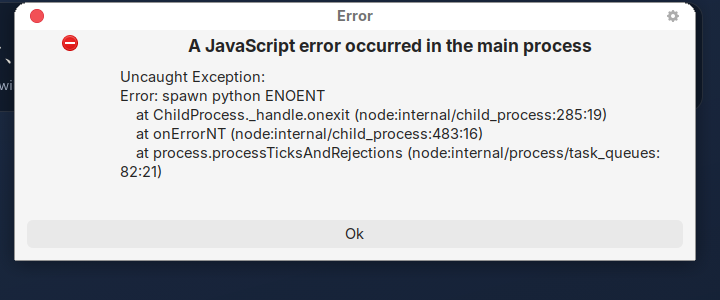

# 03 — Startup modernization: removing `start_jtutor.bat` and `stop_jtutor.bat`

Goal: a user double-clicks one icon, the app opens, everything it needs starts
with it, and closing the window stops everything. No terminal windows, no batch
files, no "Python 3.11+ required".

---

## 1. How Jtutor starts today

There are **four** different startup paths in the repository, and they disagree.

| Path | Entry point | What it starts | Where the UI is served from |
|------|-------------|----------------|-----------------------------|
| Dev, browser | `start_jtutor.bat` | Two `cmd /k` windows (uvicorn, Vite), then opens a browser | Vite `:5173` |
| Dev, Electron | `start_jtutor_electron.bat` | Two `cmd /k` windows, then `npx electron .` — and Electron spawns a **third** backend | Vite `:5173` |
| Portable zip | `release/START.bat` | One minimized `cmd`, `.venv\Scripts\python.exe`, then opens a browser | FastAPI `:8765` static mount |
| NSIS installer | `apps/desktop/electron/main.cjs` | Spawns `python -m uvicorn` as a child of Electron | FastAPI `:8765` static mount |

`stop_jtutor.bat` and `release/STOP.bat` exist purely to clean up after the first
three: they `netstat`-scan for listeners on 8765 and 5173 and `taskkill /F` them.

### 1.1 The Electron path is already 80% of the answer

`apps/desktop/electron/main.cjs` already:

- spawns the backend on app ready (`startBackend`),
- polls `GET /health` for up to 45 s (`waitForHealth`),
- loads the FastAPI-served UI in packaged mode (`win.loadURL(`${API}/`)`),
- kills the child on `window-all-closed` and `before-quit`.

And `backend/app/main.py` already mounts the built UI at `/`:

```
$ curl -s -o /dev/null -w "%{http_code} %{content_type}\n" http://127.0.0.1:8765/
200 text/html; charset=utf-8
$ curl -s -o /dev/null -w "%{http_code}\n" http://127.0.0.1:8765/assets/index-DNwtJqY8.css
200
```

So the architecture for "one process tree, no scripts" is present. What is
missing is everything that makes it survive contact with a real machine.

---

## 2. Why the batch files are still required

### 2.1 The packaged app ships no Python

A real package built from the committed `build` config:

```
$ npx electron-builder --linux dir
$ ls dist-electron/linux-unpacked/resources/
app.asar  app-update.yml  assets  backend  content  ui

$ ls dist-electron/linux-unpacked/resources/backend/
app  __init__.py  requirements.txt

$ find dist-electron/linux-unpacked -iname "python*" -o -iname "site-packages"
(no results)
```

`extraResources` copies `backend/` as **source** plus a `requirements.txt`. There
is no interpreter, no virtual environment and no installed dependency
(`fastapi`, `uvicorn`, `faster_whisper`, `fsrs`, …). The installed app therefore
cannot run until the user separately installs Python 3.11+, puts it on `PATH`,
and runs `pip install -r requirements.txt` — which is precisely what
`release/INSTALL.bat` does and what the NSIS installer never does.

### 2.2 A missing `python` crashes the main process

`startBackend()` calls `spawn(python, …)` and never attaches an `error`
listener. When the executable is not found, Node emits `'error'` on the
`ChildProcess`; unhandled, it becomes an uncaught exception in the Electron main
process.

Verified by launching the real package on a machine where `python3` exists but
`python` does not — exactly the situation on Windows when the user did not tick
"Add python.exe to PATH", or when the Microsoft Store `python` alias is in play:



```
A JavaScript error occurred in the main process
Uncaught Exception:
Error: spawn python ENOENT
    at ChildProcess._handle.onexit (node:internal/child_process:285:19)
```

No window ever appears. There is no message telling the user what is wrong.

### 2.3 Backend failures are invisible by design

```js
{ cwd: root, env, stdio: "ignore", windowsHide: true }
```

`stdio: "ignore"` throws away the backend's stdout and stderr, so import errors,
missing packages and bind failures leave no trace anywhere the user or a
maintainer can see.

### 2.4 No port-conflict handling — verified

With a backend already listening on 8765 (the state after any `start_jtutor.bat`
run), Electron was launched:

```
$ ps -eo pid,ppid,cmd | grep -E "uvicorn|electron/dist/electron \."
 4848  3503  python3 -m uvicorn backend.app.main:app --host 127.0.0.1 --port 8765
 5997  5990  /workspace/node_modules/electron/dist/electron . --no-sandbox
```

The uvicorn process's parent is `3503` — the pre-existing shell, not Electron
(`5997`). Electron's own child died instantly from "address already in use", and
because stderr is discarded, **nothing was printed**. `waitForHealth()` then
succeeded against the *foreign* process, so the window opened and the app looked
perfectly healthy while being attached to a backend it does not own.

On quit, Electron called `backendProc.kill()` on an already-dead PID:

```
$ kill 5997      # close Electron
$ curl -s -o /dev/null -w "%{http_code}\n" http://127.0.0.1:8765/health
200              # the other backend is still running
```

That leftover process is the entire reason `stop_jtutor.bat` exists.

### 2.5 The health check result is discarded

```js
startBackend();
await waitForHealth();   // returns false on timeout — never inspected
createWindow();
```

If the backend never comes up, the window opens anyway and calls
`win.loadURL("http://127.0.0.1:8765/")`, which fails with
`ERR_CONNECTION_REFUSED` and renders Chromium's default error page. There is no
`did-fail-load` handler. Meanwhile, for up to 45 seconds before that, **no window
exists at all** — the user double-clicks the icon and nothing happens.

### 2.6 The dev workflow genuinely needs two servers

`start_jtutor.bat` also exists because development needs Vite's HMR alongside
uvicorn's reload. That is a legitimate need — but it should be `npm run dev`, not
a batch file, and it should not be what end users are told to run.

### 2.7 No single-instance lock

`app.requestSingleInstanceLock()` is not used, so launching Jtutor twice starts a
second Electron, a second backend attempt, a second port collision, and a second
silent failure.

### Summary of root causes

| # | Root cause | Consequence |
|---|-----------|-------------|
| 1 | No Python runtime in the package | End users must install Python and dependencies by hand |
| 2 | No `error` handler on `spawn` | Hard crash when `python` is absent |
| 3 | `stdio: "ignore"` | Failures are undiagnosable |
| 4 | Fixed port, no conflict detection | Silent attachment to a foreign backend; orphans |
| 5 | `waitForHealth()` result ignored, no splash | Long dead-air, then a Chromium error page |
| 6 | Dev needs Vite | A script gets written, then reused as the user-facing launcher |
| 7 | No single-instance lock | Duplicate process trees |

---

## 3. The three options

### Option A — Keep FastAPI as an Electron child process, hardened

Electron owns the lifecycle exactly as it does now, but with a supervised,
observable child.

| | |
|---|---|
| **Pros** | Smallest delta from today; one process tree; single-window UX; easy to log and restart; already partly implemented |
| **Cons** | Still needs a Python interpreter *from somewhere*; on its own does not solve §2.1 |
| **Effort** | Small — rewrite of ~100 lines in `main.cjs` plus a supervisor module |

### Option B — Freeze FastAPI into a standalone executable (PyInstaller) and auto-launch it

The backend becomes `jtutor-backend.exe`, bundled as an `extraResource`, spawned
by Electron the same way.

| | |
|---|---|
| **Pros** | Zero Python prerequisite for the user; the app becomes genuinely double-clickable; version skew between app and dependencies disappears; installer becomes real |
| **Cons** | Build complexity (hidden imports, per-OS builds); large artifact — `faster-whisper` pulls `ctranslate2` + `onnxruntime` + `av`, so expect a 300–600 MB payload before the Whisper model itself; antivirus false positives on unsigned PyInstaller binaries are common on Windows |
| **Effort** | Medium — a spec file, a CI build matrix, and packaging changes |

### Option C — Run FastAPI as an OS background service

A Windows Service / launchd agent / systemd user unit installed alongside the
app.

| | |
|---|---|
| **Pros** | Backend survives UI restarts; could serve multiple clients |
| **Cons** | Requires elevation on Windows; three separate service implementations to maintain; a service that keeps running after the app is closed is wrong for a study app; uninstall becomes error-prone; conflicts with per-user data directories; "app closed but Python still running" is the exact complaint that produced `stop_jtutor.bat` |
| **Effort** | Large, with the worst ongoing maintenance cost |

---

## 4. Recommendation: **B on top of A**

Adopt **Option A's supervised-child architecture** and feed it a **PyInstaller
one-folder executable (Option B)** as the default backend, with a graceful
fallback to a system Python for development and for anyone building from source.

Reject Option C. A background service outliving the window is the opposite of
what a single-user desktop study app needs, and it multiplies platform-specific
code.

The combination gives:

- No Python prerequisite (B), while keeping the developer loop unchanged (A's
  fallback).
- One supervised process tree, so closing the window always stops the backend
  (A).
- A single place — the supervisor — that owns port selection, health, logging,
  crash restart and shutdown.

### Backend resolution order at runtime

```
1. $JTUTOR_BACKEND_EXE                      (explicit override, CI/debug)
2. <resources>/backend-dist/jtutor-backend  (frozen executable — shipped default)
3. $JTUTOR_PYTHON -m uvicorn …              (explicit interpreter)
4. python3 / python / py -3 on PATH         (dev fallback, probed for version)
5. → BackendUnavailableError                (friendly dialog, never a crash)
```

---

## 5. Implementation plan

### Phase 1 — Harden the supervisor (no packaging change)

Deliverable: `apps/desktop/electron/backend.cjs`, a `BackendSupervisor` class,
plus a rewritten `main.cjs`. After this phase the Electron path is reliable and
`start_jtutor_electron.bat` and `stop_jtutor.bat` can be deleted.

**1.1 Pick a free port instead of hardcoding 8765.**

```js
const net = require("net");
function freePort() {
  return new Promise((res, rej) => {
    const s = net.createServer();
    s.on("error", rej);
    s.listen(0, "127.0.0.1", () => { const { port } = s.address(); s.close(() => res(port)); });
  });
}
```

Pass it as `--port` and export it through the preload bridge. This alone removes
port-conflict class of bugs and makes two instances harmless.

**1.2 Generate a per-run auth token.**

`crypto.randomUUID()` at launch, passed to the backend as `JTUTOR_TOKEN` and to
the renderer via preload. A FastAPI dependency rejects requests without it. This
closes the "any local process can drive your tutor" hole opened by
`allow_origins=["*"]`, and lets CORS be locked to the app origin.

**1.3 Resolve the backend command through the ordered list above**, probing
candidate interpreters with `--version` and checking `>= 3.11` before use.

**1.4 Capture output.** `stdio: ["ignore", "pipe", "pipe"]`, tee both streams to
`<userData>/logs/backend.log` (rotating) and to the main-process console in dev.

**1.5 Handle every failure mode.**

```js
child.on("error", onSpawnError);        // ENOENT, EACCES → friendly dialog
child.on("exit", onExit);               // record code + last 40 log lines
```

**1.6 Splash window.** Show a small frameless window immediately on
`app.whenReady()` with the logo and "Starting Jtutor…", switch it to
"Still starting — first run loads the speech model" after 8 s, and only then swap
to the main window. Never leave the user with no window.

**1.7 Act on the health result.**

```js
const ok = await supervisor.waitForHealth(60_000);
if (!ok) return showStartupFailure(supervisor.diagnostics());
```

`showStartupFailure` renders a real dialog: what failed, the last log lines,
*Retry*, *Open logs*, *Quit*.

**1.8 Crash restart with backoff.** If the child exits non-zero while the window
is open, restart up to 3 times with 1 s/2 s/4 s backoff, showing a
"Reconnecting…" chip in the UI. After 3 failures, show the failure dialog.

**1.9 Deterministic shutdown.**

- Ask politely first: `POST /internal/shutdown` (token-guarded), which triggers
  `uvicorn`'s graceful exit.
- Then `child.kill("SIGTERM")`, then after 3 s `taskkill /pid <pid> /T /F` on
  Windows or `SIGKILL` elsewhere.
- Do this in `before-quit` with `event.preventDefault()` until the child is
  reaped, so the app does not exit ahead of its backend.
- Also handle `SIGINT`/`SIGTERM` on the main process for `Ctrl+C` in dev.

**1.10 Orphan sweeping.** Write `<userData>/backend.pid` containing pid, port and
start time. On launch, if the file exists, verify the pid is a Jtutor backend
(query `/health` and compare an instance id) and terminate it before starting a
new one. This is `stop_jtutor.bat`, done automatically and safely.

**1.11 Single instance.**

```js
if (!app.requestSingleInstanceLock()) app.quit();
app.on("second-instance", () => { win?.restore(); win?.focus(); });
```

**1.12 Load-failure handling.** `win.webContents.on("did-fail-load", …)` renders a
bundled offline error page with *Retry*, instead of Chromium's default.

Sketch of the resulting `main.cjs` flow:

```js
app.whenReady().then(async () => {
  if (!app.requestSingleInstanceLock()) return app.quit();
  const splash = createSplash();
  const supervisor = new BackendSupervisor({ resourcesPath, userData, logger });
  try {
    await supervisor.sweepOrphans();
    await supervisor.start();                       // picks port, spawns, tees logs
    await supervisor.waitForHealth(60_000);         // throws on timeout
    createMainWindow(supervisor.baseUrl, supervisor.token);
  } catch (err) {
    showStartupFailure(err, supervisor.diagnostics());
  } finally {
    splash.close();
  }
});
```

### Phase 2 — Freeze the backend with PyInstaller

**2.1 Add an entry point** `backend/main_frozen.py`:

```python
import argparse, os

def main() -> None:
    p = argparse.ArgumentParser()
    p.add_argument("--host", default="127.0.0.1")
    p.add_argument("--port", type=int, required=True)
    p.add_argument("--root", default=None)
    p.add_argument("--data-dir", default=None)
    a = p.parse_args()

    # Must be set BEFORE importing backend.app: main.py and config.py both read
    # JTUTOR_ROOT at module import time.
    if a.root:
        os.environ["JTUTOR_ROOT"] = a.root
    if a.data_dir:
        os.environ["JTUTOR_DATA_DIR"] = a.data_dir

    import uvicorn
    from backend.app.main import app
    uvicorn.run(app, host=a.host, port=a.port, log_config=None)

if __name__ == "__main__":
    main()
```

Two details that matter:

- `uvicorn.run(app, …)` takes the app object, not the `"backend.app.main:app"`
  string. The string form re-imports by module path, which does not work under a
  frozen interpreter.
- `backend/app/main.py` resolves `ROOT` and `backend/app/config.py` resolves
  `_default_root()` at **import** time, so `JTUTOR_ROOT` and `JTUTOR_DATA_DIR`
  have to be in the environment before the first `import backend.app`. Deferring
  the import inside `main()` is the simplest way to guarantee that.

**2.2 `packaging/jtutor-backend.spec`.** Use **one-folder** mode (`--onedir`), not
one-file: one-file unpacks a few hundred MB to a temp directory on every launch,
which adds seconds to startup and trips antivirus. Hidden imports that PyInstaller
will not find on its own include `uvicorn.logging`, `uvicorn.loops.auto`,
`uvicorn.protocols.*`, `uvicorn.lifespan.on`, `faster_whisper`, `ctranslate2`,
`av`, `onnxruntime`, `fsrs`, `sqlalchemy.dialects.sqlite` and `pydantic`'s compiled
core. `yaml` data files and the `tokenizers` assets need explicit `datas` entries.

**2.3 Print the chosen port on stdout** (`JTUTOR_PORT=54321`) so the supervisor can
read it back when it passes `--port 0`, or keep the supervisor authoritative by
passing an explicit free port. The latter is simpler; keep it.

**2.4 Build matrix in CI** — Windows x64 first (the documented target), then
macOS arm64/x64 and Linux x64. Sign the Windows binary if a certificate is
available; unsigned PyInstaller output is a common false-positive for
SmartScreen and several AV vendors.

**2.5 Whisper model handling.** Do **not** bundle the `small` model (~460 MB) in
the installer. Instead:
- Ship with `WHISPER_MODEL=base` as the default for first run, or
- download on first use with visible progress through a new
  `GET /voice/model-status` + `POST /voice/download-model` pair, surfaced in the
  setup wizard.

Either way, warm the model at startup in a worker thread
([04 §2.2](04-architecture-improvements.md)) so the first recording is not the
thing that pays for it.

### Phase 3 — Packaging changes

**3.1 `package.json` `build` block:**

```jsonc
{
  "build": {
    "appId": "com.jtutor.app",
    "productName": "Jtutor",
    "asar": true,
    "files": ["apps/desktop/electron/**/*", "package.json"],
    "extraResources": [
      { "from": "dist-backend/jtutor-backend", "to": "backend-dist" },
      { "from": "content", "to": "content", "filter": ["**/*", "!**/audio_transcripts.json"] },
      { "from": "apps/desktop/dist", "to": "ui" }
    ],
    "win":   { "target": ["nsis"] },
    "mac":   { "target": ["dmg"], "category": "public.app-category.education" },
    "linux": { "target": ["AppImage"], "category": "Education" },
    "nsis":  { "oneClick": false, "allowToChangeInstallationDirectory": true, "perMachine": false }
  }
}
```

Note that `backend/` source drops out of `extraResources` — the frozen build
replaces it.

**3.2 Writable data location.** `settings.data_dir` currently resolves to
`<root>/data`, which under `Program Files` is not writable. Add a
`JTUTOR_DATA_DIR` environment variable, set by the supervisor to Electron's
`app.getPath("userData")`, and default `settings.data_dir` to it. Same for
`assets_dir`, so users can point at their Irodori folder without copying it into
the install directory.

**3.3 Scripts.**

```jsonc
"scripts": {
  "dev":            "concurrently -k \"npm:dev:backend\" \"npm:dev:ui\" \"npm:dev:electron\"",
  "dev:backend":    "python -m uvicorn backend.app.main:app --host 127.0.0.1 --port 8765 --reload",
  "dev:ui":         "npm run dev --prefix apps/desktop",
  "dev:electron":   "wait-on tcp:5173 && electron .",
  "build:ui":       "npm run build --prefix apps/desktop",
  "build:backend":  "pyinstaller packaging/jtutor-backend.spec --noconfirm --distpath dist-backend",
  "dist":           "npm run build:ui && npm run build:backend && electron-builder"
}
```

`dev:backend` uses a cross-platform invocation rather than the current
`set PYTHONPATH=%CD%&&` Windows-only string; `PYTHONPATH` is unnecessary once
`backend` is installed in editable mode or the working directory is the repo
root.

**3.4 Delete, with replacements documented:**

| Removed | Replaced by |
|---------|-------------|
| `start_jtutor.bat` | Desktop shortcut created by the installer |
| `start_jtutor_electron.bat` | `npm run dev` |
| `stop_jtutor.bat` | Automatic orphan sweep + deterministic shutdown (§5 Phase 1.9/1.10) |
| `scripts/start_desktop.bat` | `npm run dev` |
| `scripts/run_backend.bat` | `npm run dev:backend` |
| `release/START.bat`, `STOP.bat`, `INSTALL.bat`, `make_release.ps1` | The installer produced by `npm run dist` |

Keep them for one release behind a deprecation notice if the portable zip has
existing users, then remove.

**3.5 Auto-update (optional).** With a real installer, `electron-updater` against
GitHub Releases becomes straightforward and removes "send them a new zip" from
the distribution story.

---

## 6. Required code changes, file by file

| File | Change |
|------|--------|
| `apps/desktop/electron/main.cjs` | Rewrite: single-instance lock, splash, supervisor, health gating, failure dialog, `did-fail-load`, deterministic quit |
| `apps/desktop/electron/backend.cjs` | **New** — `BackendSupervisor`: resolve command, free port, token, spawn, tee logs, health poll, restart backoff, orphan sweep, graceful stop |
| `apps/desktop/electron/splash.html` | **New** — logo, progress text, no chrome |
| `apps/desktop/electron/error.html` | **New** — startup failure page with Retry / Open logs / Quit |
| `apps/desktop/electron/preload.cjs` | Expose `apiBase` (dynamic port), `token`, `openLogs()`, `restartBackend()`, `platform` |
| `apps/desktop/src/api.ts` | Read base URL and token from the preload bridge; attach the token header; `AbortController` on every call |
| `apps/desktop/src/jlog.ts` | Same base-URL source instead of a second hardcoded constant |
| `backend/main_frozen.py` | **New** — argparse + `uvicorn.run(app, …)` entry point |
| `backend/app/main.py` | Replace `@app.on_event("startup")` with a `lifespan` handler; add token dependency; restrict CORS to the app origin; resolve `_UI_DIR` lazily; add `POST /internal/shutdown`; add an instance id to `/health` |
| `backend/app/config.py` | `JTUTOR_DATA_DIR` / `JTUTOR_ASSETS_DIR` support; `port: int = 0` meaning "assigned by the supervisor" |
| `packaging/jtutor-backend.spec` | **New** — PyInstaller spec with hidden imports and data files |
| `package.json` | New scripts, new `build.extraResources`, mac/linux targets |
| `.github/workflows/build.yml` | **New** — lint, tests, `build:backend`, `build:ui`, `electron-builder` per OS |
| `README.md`, `docs/SETUP.md`, `docs/DISTRIBUTE.md` | Rewrite the quick start around the installer; keep a "build from source" section |

---

## 7. Startup sequence after the change

```
User double-clicks Jtutor
  │
  ├─ single-instance lock            (already running? focus it and exit)
  ├─ splash window                   ~120 ms, always visible
  ├─ sweep orphaned backend          (pid file → verify → terminate)
  ├─ pick a free 127.0.0.1 port
  ├─ resolve backend command         frozen exe → JTUTOR_PYTHON → PATH python
  ├─ spawn with token + port + data dir, stdout/stderr → rotating log
  ├─ poll /health                    splash text updates at 8 s and 20 s
  │     ├─ ok    → main window on http://127.0.0.1:<port>/
  │     └─ fail  → failure dialog with logs, Retry, Quit
  │
  └─ on quit: POST /internal/shutdown → SIGTERM → force kill after 3 s
                                       → reap → remove pid file → exit
```

No terminal windows. No batch files. Closing the window always stops the
backend, and a crash on either side is reported rather than silent.

---

## 8. Acceptance criteria

Concrete, testable statements to hold the implementation to:

1. On a clean Windows VM with **no Python installed**, the installer produces a
   working app that starts from the Start menu shortcut.
2. Launching twice focuses the existing window; exactly one backend process
   exists.
3. Closing the window leaves **zero** `jtutor-backend`/`python` processes after
   5 s (verified with `tasklist` / `ps`).
4. Killing the backend externally while the app is open shows a "Reconnecting…"
   state and recovers within 10 s.
5. Occupying the chosen port before launch does not prevent startup (a different
   port is chosen).
6. With the backend deliberately broken, the user sees a dialog naming the
   problem and can open the log — never a blank window, never
   `ERR_CONNECTION_REFUSED`, never an uncaught-exception dialog.
7. A window is visible within 1 s of launch in every case.
8. `start_jtutor.bat`, `stop_jtutor.bat` and `start_jtutor_electron.bat` are gone
   from the repository and from the docs.

---

## 9. Risks and mitigations

| Risk | Mitigation |
|------|-----------|
| PyInstaller misses a hidden import and the frozen backend fails only in the installer | Smoke test the frozen binary in CI: start it, `GET /health`, `POST /tutor/L01/start`, `POST /voice/transcribe` with a fixture WAV |
| Installer size (300–600 MB) | One-folder mode with compression; ship `base` Whisper by default and download larger models on demand; consider an optional "lite" build without `faster-whisper` that falls back to typed answers |
| Windows SmartScreen / AV false positives | Code-sign the executable and the installer; publish hashes; document the first-run warning |
| macOS notarization | Required for distribution outside the App Store; adds an Apple Developer account to the release process |
| Frozen backend diverges from the dev backend | Same source, same requirements pin; CI builds the frozen backend on every PR |
| Dynamic port breaks anything that assumed 8765 | The port is exposed through preload and `/health`; the docs' `curl` examples become `http://127.0.0.1:<port>` with the port shown in Settings → Advanced |
| Users who currently rely on the browser at `:5173` | The Electron window is the supported surface; a "Open in browser" item in Settings → Advanced prints the current URL for anyone who wants it |
